### ArtChain艺链

本项目是一个面向艺术品数字版权确权与交易的全栈平台，采用 Go（Gin）+ Vue3 + Solidity 技术栈，结合区块链不可篡改、智能合约自动执行等特性，实现艺术品的注册、认证、上链、交易与数据可视化，提升艺术品市场的透明度与安全性。


### 环境准备

- **操作系统**：Windows 10/11
- **数据库**：MySQL 8.0.23 及以上
- **后端**：Go 1.18+，Gin，GORM
- **前端**：Node.js 16+，npm 8+，Vue 3，Element Plus
- **区块链开发环境**：Ganache（本地以太坊测试链）、Truffle、Solidity 0.8.18
- **数字钱包**：MetaMask 浏览器插件
- **依赖管理**：go mod、npm
- **其他工具**：Git


### 项目结构

```plaintext
ac/
├── blockchain/      # 智能合约、部署脚本
├── controller/      # 后端控制
├── dao/             # 数据访问
├── middlewares/     # Gin 中间件
├── model/           # 数据模型
├── req/             # 请求结构体
├── service/         # 业务逻辑
├── utils/           # 工具函数
├── vendor/          # Go 依赖
├── web/             # 前端 Vue3 项目
├── main.go          # 后端入口
├── go.mod           # Go 依赖管理
```


### 功能模块

- 用户与权限管理（注册、登录、私钥找回、信息管理、权限分级）
- 艺术品认证确权（上传、审核、确权、NFT 铸造）
- 艺术品交易（上架、购物车、支付、区块链所有权转移）
- 交易记录（购买/售出/待交易记录查询，状态跟踪）
- 数据监测（区块链浏览器、交易数据统计与可视化）
- 管理员后台（用户管理、艺术品审核、数据监控）


### 快速部署

1. **数据库初始化**
   - 安装 MySQL，创建数据库 `ac_db`，导入表结构（可通过 ORM 自动生成或使用 SQL 脚本）。

2. **区块链环境配置**
   - 安装 Ganache，创建本地以太坊测试网络。
   - 安装 Truffle：`npm install -g truffle`
   - 部署合约：  
     ```bash
     cd blockchain
     truffle compile
     truffle migrate --reset
     ```
   - 配置前端 `.env` 文件，填写合约地址。

3. **后端启动**
   ```bash
   go run main.go
   ```

4. **前端启动**
   ```bash
   cd web/project/src
   npm run serve
   ```

5. **MetaMask 配置**
   - 安装 MetaMask 插件，添加本地测试网络，导入 Ganache 账户私钥。

6. **访问系统**
   - 浏览器：http://localhost:8080  


### 项目展示

- 介绍页
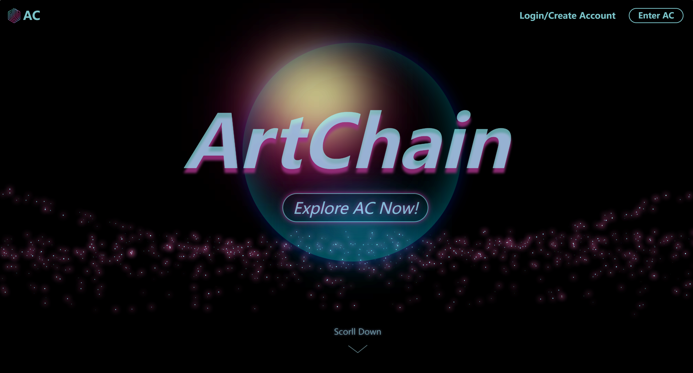


- 登录注册页（用户）
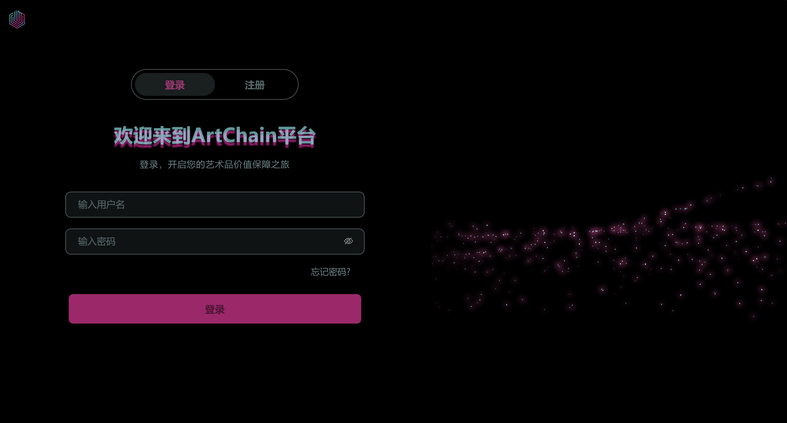


- 商城首页
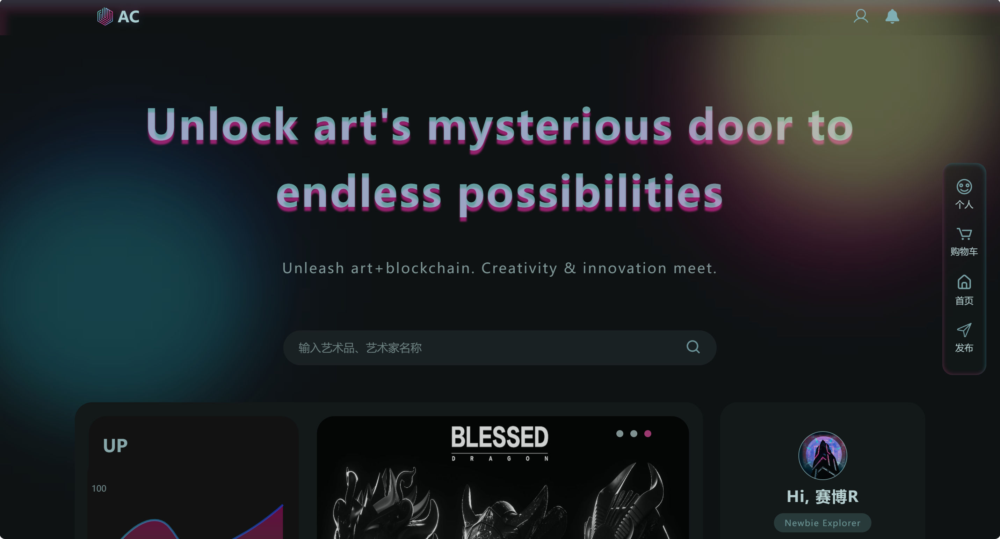

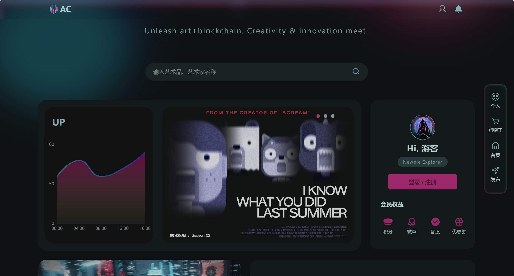

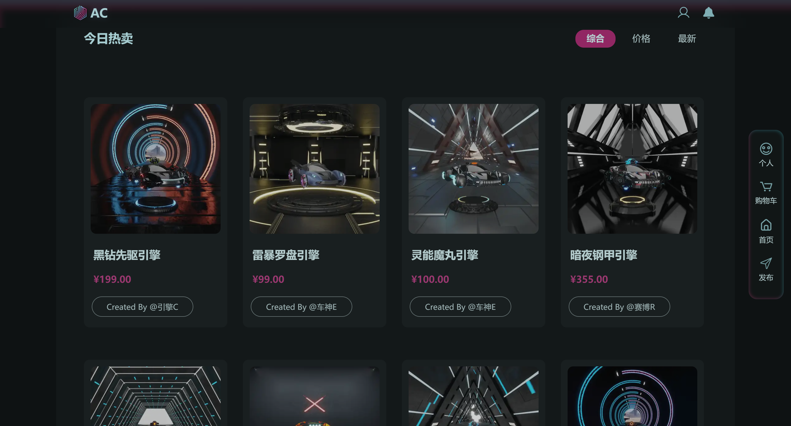


- 艺术品详情页
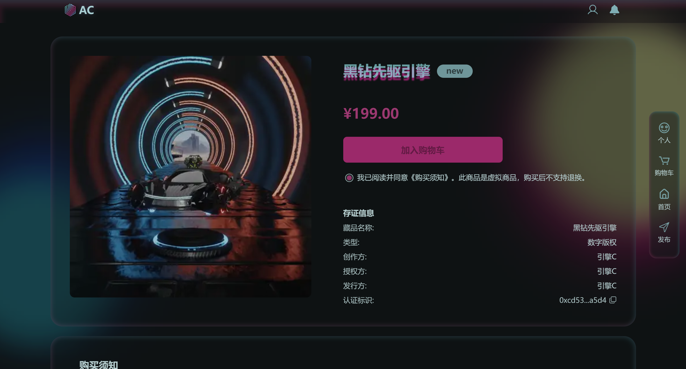


- 购物车
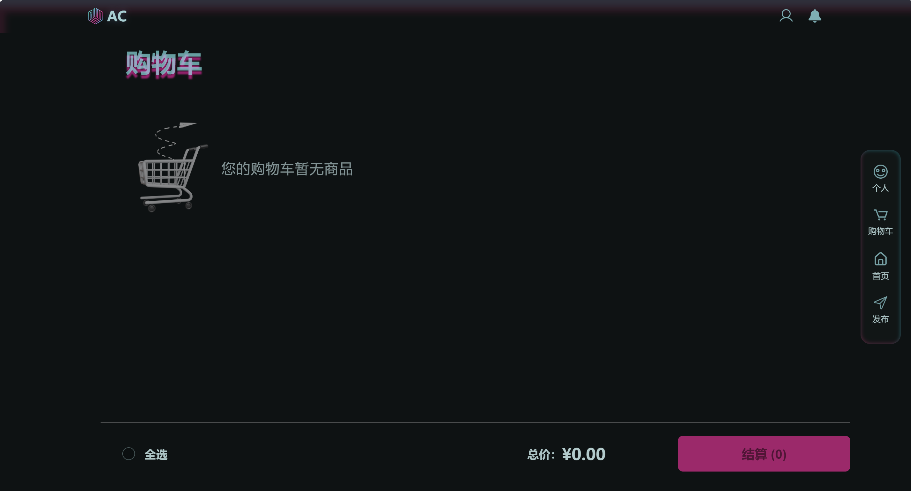

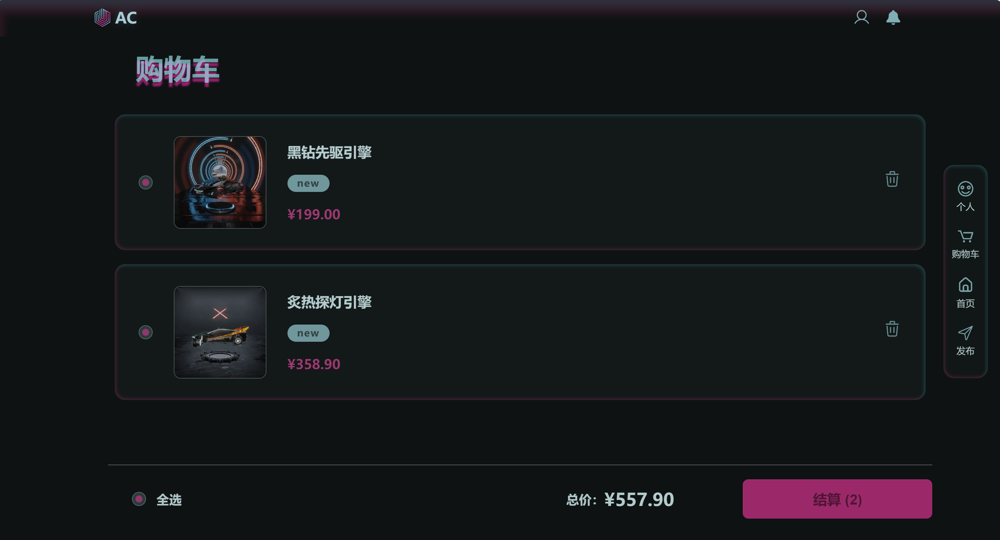


- 个人信息修改
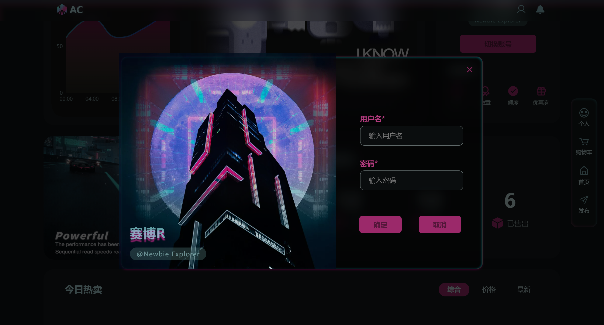


- 上传页
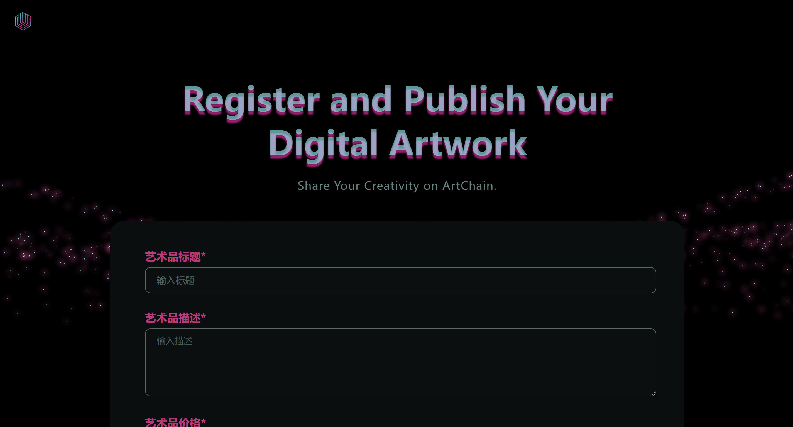


- 订单页
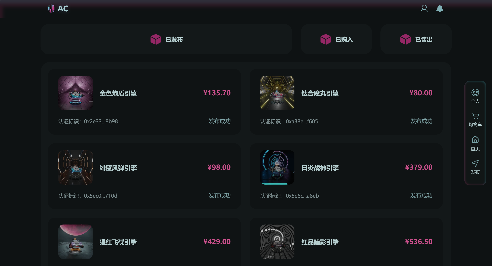


- 登录页（管理员）
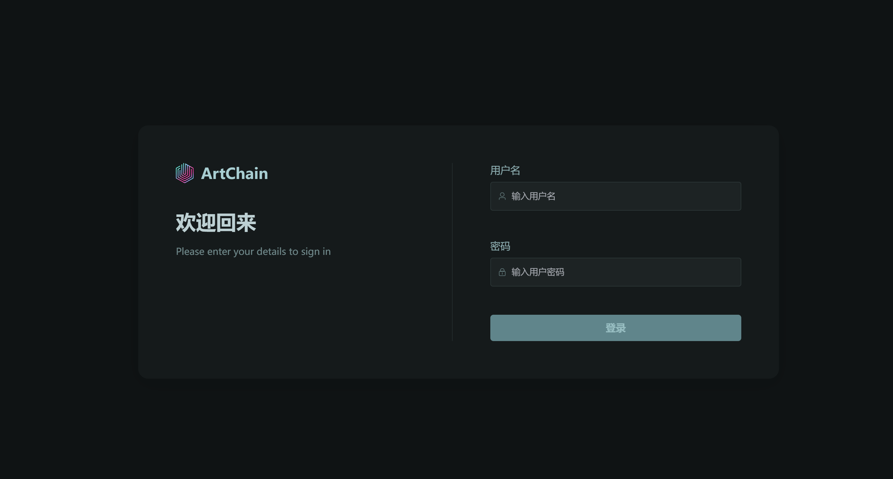


- 数据监测
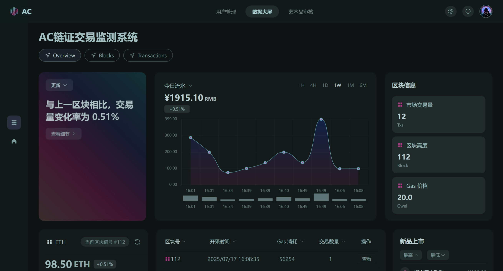


- 艺术品审核
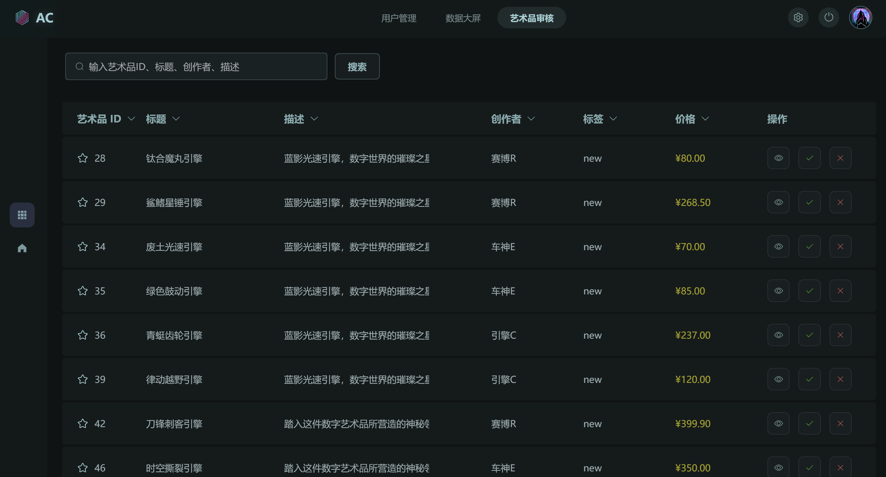

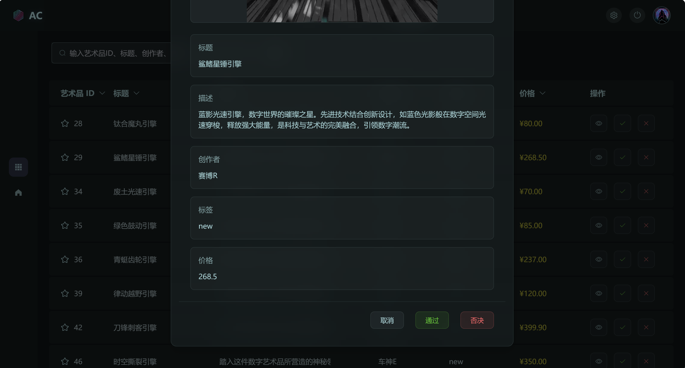


---

> 欢迎 Star & Fork，交流合作！
